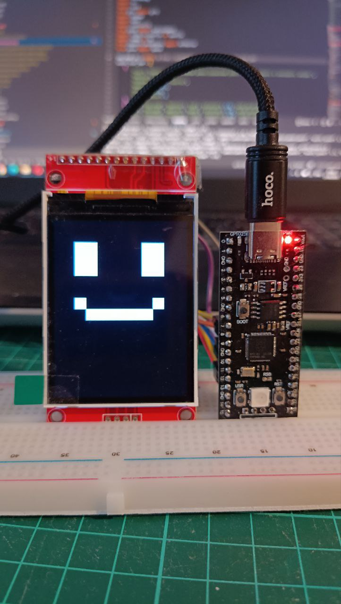

# pico-interactive-robot
## О проекте

Интерактивный робот на базе Raspberry Pi Pico (RP2040) с прошивкой на MicroPython. Управляется через USB с помощью Python-скрипта `command.py`, работающего на ПК. Команды передаются в формате JSON, робот реагирует изменением выражения лица на LED-дисплее, имитируя эмоции или разговор.

Проект ориентирован на энтузиастов и тех, кто хочет быстро начать эксперименты с дисплеем и Pico без лишних сложностей. Все материалы предоставляются для ознакомления и самостоятельных экспериментов.

## Принцип работы системы


## Фото Mr. PICO

<div align="center">
  <table>
    <tr>
      <td></td>
      <td></td>
      <td></td>
       <td></td>
      <td></td>
      <td></td>
      <td></td>
    </tr>
  </table>
</div>


### Основное:
- **Платформа:** Raspberry Pi Pico (RP2040)
- **Прошивка:** MicroPython
- **Связь:** USB (серийный порт)
- **Команды:** JSON (пример: `{"emotion": "talking", ...}`)
- **Отображение:** эмоции и мимика на LED-дисплее

Проект подходит для экспериментов с интерактивными системами и эмоциональным UI на микроконтроллерах.

### Список команд

Доступные команды для управления роботом:

- `emotion` - базовая эмоция робота:
  - `neutral` - нейтральное выражение
  - `smile` - улыбка
  - `smile_love` - улыбка с любовью
  - `embarrassed` - смущение
  - `scary` - испуг
  - `happy` - радость
  - `sad` - грусть
  - `surprise` - удивление
  - `talking` - режим разговора
  
#### Параметр `talking_emotion` (только для режима `talking`):

- `neutral` — обычная анимация рта (по умолчанию)
- `angry` — сердитая мимика во время разговора
- `smile` — улыбка во время разговора
- `smile_tricky` — хитрая улыбка во время разговора
- `tricky` — озорная мимика во время разговора
- `ha` — радостная/смеющаяся мимика

Можно комбинировать с параметрами `mouth_speed`, `duration`, `intensity` для более живой анимации.

При использовании `talking` доступны дополнительные параметры:
- `text` - текст для синтеза речи
- `talking_emotion` - эмоция во время разговора (`neutral` или `angry`)
- `mouth_speed` - скорость движения рта (от 0.1 до 1.0)

Параметры анимации:
- `duration` - длительность анимации в секундах
- `intensity` - интенсивность анимации (от 0.1 до 1.0)


Пример JSON-команды, отправляемой на устройство через `command.py`:

```json
{
    "text": "Привет, ого, как же здорово тебя видеть!...",
    "emotion": "talking",
    "talking_emotion": "neutral",
    "mouth_speed": 0.6,
    "duration": 1.0
}
```

### Подключение: пины дисплея к Raspberry Pi Pico

| Назначение         | Пин Pico (RP2040) | Название на дисплее | Описание                |
|--------------------|-------------------|---------------------|-------------------------|
| GND                | GND               | GND                 | Земля                   |
| VCC                | 3V3               | VCC                 | Питание 3.3В            |
| SCL (SCK)          | GP16              | SCL                 | Serial Clock (SPI SCK)  |
| SDA (MOSI)         | GP18              | SDA                 | Master Out (SPI MOSI)   |
| RST (RESET)        | GP20              | RST                 | Сброс дисплея           |
| DC (D/C)           | GP21              | DC                  | Data/Command            |
| CS                 | GP17              | CS                  | Chip Select             |
| BL (подсветка)     | GP22              | BL                  | Подсветка дисплея       |

> **Примечание:**  
> - Назначения пинов взяты из файла `tft_config.py` для дисплея TENSTAR ROBOT 2.4" TFT ST7789V 320x240.  


### Как прошить MicroPython на Raspberry Pi Pico (RP2040)

1. **Скачайте прошивку MicroPython:**
   - Перейдите на официальный сайт: [https://micropython.org/download/rp2-pico/](https://micropython.org/download/rp2-pico/)
   - Скачайте файл с расширением `.uf2` (например, `micropython.uf2`).

2. **Переведите Pico в режим загрузки:**
   - Отключите Pico от компьютера.
   - Зажмите кнопку `BOOTSEL` на плате.
   - Подключите Pico к компьютеру через USB, удерживая кнопку.
   - Отпустите кнопку после подключения.

3. **Скопируйте прошивку:**
   - На компьютере появится новый диск `RPI-RP2`.
   - Просто перетащите скачанный файл `.uf2` на этот диск.
   - После копирования Pico автоматически перезагрузится — теперь на нем установлен MicroPython.

4. **Проверьте работу:**
   - Для работы с Pico используйте программы, такие как [Thonny](https://thonny.org/) или [PuTTY](https://www.putty.org/).
   - В Thonny выберите "Интерпретатор MicroPython (Raspberry Pi Pico)" в настройках.

> **Подсказка:**  
> Прошивка занимает всего несколько секунд и не требует специальных драйверов на Windows 10/11.

Подробнее: [Официальная инструкция (на английском)](https://www.raspberrypi.com/documentation/microcontrollers/micropython.html)

> **Важно:**  
> Проект создан для личного удовольствия и экспериментов. Если вы решите использовать код или вносить изменения, помните: вы делаете это на свой страх и риск. Я не могу гарантировать стабильность, но буду рад, если мой опыт окажется кому-то полезен.
